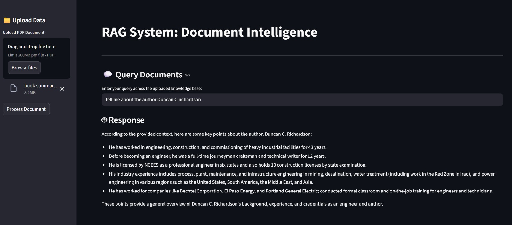

# Local RAG System

A local RAG (Retrieval-Augmented Generation) system that allows you to chat with your documents using local LLMs.



## Features
- **Local LLM Integration**: Powered by Llama 3 via Ollama.
- **Local Embeddings**: Uses `nomic-embed-text` for fast, private vectorization.
- **Document Processing**: Automatic PDF uploading, chunking, and embedding.
- **Vector Storage**: Persistent storage using ChromaDB.
- **Clean UI**: Simple and efficient interface built with Streamlit.

## Prerequisites
1. **Ollama**: Install Ollama from [ollama.com](https://ollama.com).
2. **Models**: Pull the required models:
   ```bash
   ollama pull llama3
   ollama pull nomic-embed-text
   ```

## Installation
1. Clone the repository:
   ```bash
   git clone <your-repo-url>
   cd RAG_HCL
   ```
2. Install dependencies:
   ```bash
   pip install -r requirements.txt
   ```

## Usage
Run the application using Streamlit:
```bash
streamlit run app.py
```

## How it Works
1. **Upload**: User uploads a PDF document.
2. **Processing**: 
   - `PyPDFLoader` extracts text.
   - `RecursiveCharacterTextSplitter` breaks text into manageable chunks.
   - `OllamaEmbeddings` converts chunks into vector representations.
   - `ChromaDB` stores these vectors locally.
3. **Query**: 
   - User enters a query.
   - The system retrieves the most relevant chunks from ChromaDB.
   - Llama 3 generates a response based on the retrieved context.

## Project Structure
- `app.py`: Main Streamlit application and RAG logic.
- `requirements.txt`: List of necessary Python packages.
- `chroma_db/`: Local directory where vector embeddings are stored.
